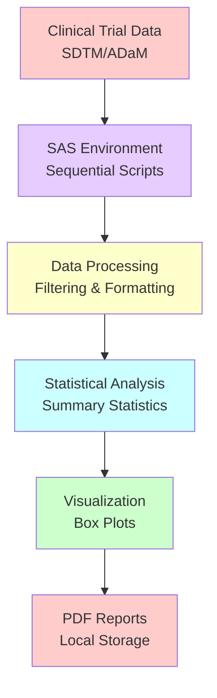
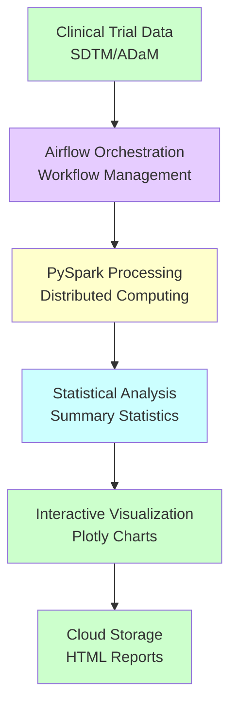

# SAS Clinical Data Analysis Pipeline Migration

This repository contains the migration of a pharmaceutical clinical data analysis pipeline from SAS to a modern Airflow + Databricks PySpark architecture.

## Overview

The original SAS-based system processed clinical trial data (SDTM format), converted it to analysis-ready ADaM datasets, performed statistical analysis on measurements like albumin levels, and generated box plot visualizations showing patient responses to treatments. This has been modernized to use Airflow for orchestration and PySpark for data processing while preserving all statistical logic.

## Data Flow Comparison

### Original SAS Workflow



### New Airflow/PySpark Workflow



## Key Migration Components

### 1. Airflow DAG Structure
- **File**: `airflow/dags/clinical_data_analysis_dag.py`
- **Tasks**: 4 sequential tasks with dependency management
- **Configuration**: Airflow Variables for runtime parameters

### 2. PySpark Data Processing
- **Data Ingestion**: `pyspark/data_ingestion.py` - SAS7BDAT to Spark DataFrame conversion
- **Preprocessing**: `pyspark/data_preprocessing.py` - Filtering and data preparation
- **Statistical Analysis**: `pyspark/statistical_analysis.py` - Aggregations and calculations
- **Outlier Detection**: `pyspark/outlier_detection.py` - Normal range and IQR outliers

### 3. Python Visualization
- **Box Plots**: `visualization/box_plots.py` - Interactive Plotly visualizations
- **Features**: Treatment grouping, outlier highlighting, statistical annotations

### 4. Configuration Management
- **Pipeline Config**: `config/pipeline_config.yaml` - Analysis parameters
- **Airflow Variables**: `config/airflow_variables.json` - Runtime configuration

### 5. Utility Functions
- **PhUSE Utilities**: `utils/phuse_utilities.py` - Statistical helper functions
- **Data Conversion**: `utils/data_conversion.py` - Format conversion utilities

## Technology Stack Comparison

| Component | Original SAS | New Architecture |
|-----------|-------------|------------------|
| **Orchestration** | Sequential SAS scripts | Airflow DAG with task dependencies |
| **Data Processing** | SAS DATA steps, PROC SQL | PySpark DataFrames |
| **Statistical Analysis** | PROC SUMMARY, PROC MEANS | PySpark groupBy().agg() |
| **Data Filtering** | WHERE clauses | DataFrame.filter() |
| **Visualization** | SGRENDER, PhUSE templates | Plotly interactive plots |
| **Configuration** | SAS macro variables | YAML + Airflow Variables |
| **Output Format** | PDF files | Interactive HTML |
| **Storage** | Local file system | Cloud storage (S3/ADLS) |
| **Scalability** | Single machine | Distributed Spark cluster |

## Statistical Equivalence

All statistical calculations produce identical results to the original SAS implementation:

### Data Filtering Logic
```sas
/* Original SAS */
where paramcd = "&m_var" and 
      not missing(aval) and
      not missing(visit) and
      not missing(trta) and
      anl01fl = 'Y'
```

```python
# PySpark Equivalent
filtered_df = df.filter(
    (col("PARAMCD") == measurement_var) &
    (col("AVAL").isNotNull()) &
    (col("AVISIT").isNotNull()) &
    (col("TRTP").isNotNull()) &
    (col("ANL01FL") == "Y")
)
```

### Statistical Aggregations
```sas
/* Original SAS */
proc summary data=css_nexttimept noprint;
  by avisitn trta avisit;
  var aval;
  output out=css_stats 
         n=n mean=mean std=std median=median 
         min=datamin max=datamax q1=q1 q3=q3;
run;
```

```python
# PySpark Equivalent
stats_df = df.groupBy("AVISITN", "TRTP", "AVISIT") \
             .agg(
                 count("AVAL").alias("n"),
                 mean("AVAL").alias("mean"),
                 stddev("AVAL").alias("std"),
                 expr("percentile_approx(AVAL, 0.5)").alias("median"),
                 min("AVAL").alias("datamin"),
                 max("AVAL").alias("datamax"),
                 expr("percentile_approx(AVAL, 0.25)").alias("q1"),
                 expr("percentile_approx(AVAL, 0.75)").alias("q3")
             )
```

## Getting Started

### Prerequisites
- Apache Airflow 2.0+
- Apache Spark 3.0+
- Python 3.8+
- Required Python packages: `pandas`, `pyspark`, `plotly`, `pyyaml`

### Setup Instructions

1. **Deploy Airflow DAG**
   ```bash
   cp airflow/dags/clinical_data_analysis_dag.py $AIRFLOW_HOME/dags/
   ```

2. **Configure Airflow Variables**
   ```bash
   airflow variables import config/airflow_variables.json
   ```

3. **Update Configuration**
   - Edit `config/pipeline_config.yaml` for your environment
   - Set data paths and output locations
   - Configure analysis parameters

4. **Run Pipeline**
   - Trigger DAG in Airflow UI
   - Monitor task execution and logs
   - View generated visualizations

### Testing

Run the comprehensive test suite:
```bash
python -m pytest tests/test_pipeline.py -v
```

## Documentation

- **Migration Guide**: `docs/migration_guide.md` - Detailed migration documentation
- **API Documentation**: Generated from docstrings in each module
- **Configuration Reference**: Parameter descriptions in `config/pipeline_config.yaml`

## Key Benefits

### Scalability
- **Horizontal Scaling**: Spark cluster can process larger datasets
- **Cloud Native**: Designed for cloud storage and compute resources
- **Resource Management**: Dynamic resource allocation based on workload

### Maintainability
- **Modular Design**: Separate components for easier maintenance
- **Version Control**: All code in Git with proper branching strategy
- **Testing**: Comprehensive test suite for validation

### Modern Features
- **Interactive Visualizations**: Plotly enables zooming, filtering, hovering
- **Real-time Monitoring**: Airflow provides workflow monitoring and alerting
- **Configuration Management**: YAML-based configuration with validation
- **Cloud Integration**: Native support for S3, ADLS, and other cloud storage

### Cost Efficiency
- **On-demand Compute**: Pay only for resources used during execution
- **Optimized Storage**: Parquet format reduces storage costs
- **Automated Scaling**: Cluster scales based on data volume

## Migration Status

✅ **Completed Components**
- Airflow DAG with 4 tasks
- PySpark data processing modules
- Statistical analysis functions
- Interactive visualization generation
- Configuration management system
- Comprehensive test suite
- Documentation and migration guide

🔄 **Next Steps**
- Deploy to production Airflow environment
- Configure Databricks cluster
- Set up cloud storage connections
- Validate outputs against original SAS results
- Train users on new system

## Support

For questions or issues with the migration:
- Review the migration guide: `docs/migration_guide.md`
- Check test results: `python -m pytest tests/ -v`
- Examine configuration: `config/pipeline_config.yaml`
- View Airflow logs for runtime issues

## Contributing

When making changes to the pipeline:
1. Update relevant configuration files
2. Add tests for new functionality
3. Update documentation
4. Validate statistical equivalence
5. Test with sample data before production deployment

## Original Repository Structure

For reference, the original repository structure is preserved:

| Path | Description |
| --- | --- |
| \SAS\data | data area |
| \SAS\data\adam | ADAM example data (from [PhUSE GitHub](https://github.com/phuse-org/phuse-scripts/tree/master/data/adam/TDF_ADaM_v1.0)) |
| \SAS\data\sdtm | SDTM example data (from [PhUSE GitHub](https://github.com/phuse-org/phuse-scripts/tree/master/data/sdtm/TDF_SDTM_v1.0)) |
| \SAS\programs | program area |
| \SAS\results | results area |
| \SAS\tools\downloads | contains downloads with no changes |
