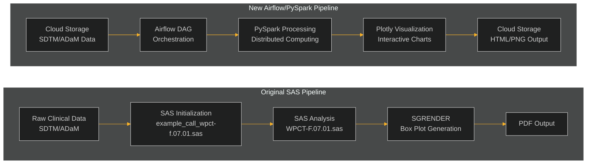

# SAS to Airflow/PySpark Migration Framework

This repository contains a comprehensive framework for migrating a SAS clinical data analysis pipeline to Airflow for orchestration and Databricks PySpark for data processing.

## Overview

The migration framework transforms a sequential SAS script execution process into a modern, scalable data pipeline using Apache Airflow and PySpark. The framework preserves the core statistical logic of the original SAS implementation while leveraging the distributed processing capabilities of Spark and the workflow management features of Airflow.

## Original vs. New Pipeline



## Pipeline Components

### 1. Airflow DAG Structure

The pipeline is implemented as a 4-task Airflow DAG:


- **Data Ingestion**: Loads clinical trial data (SDTM/ADaM) from source location
- **Data Preprocessing**: Filters and prepares data for analysis
- **Statistical Analysis**: Calculates summary statistics and identifies outliers
- **Visualization**: Generates interactive box plots using Plotly

### 2. PySpark Data Processing

The framework converts SAS data processing operations to PySpark:

- **WHERE Clauses**: Converted to PySpark DataFrame filters
- **PROC SUMMARY**: Implemented using PySpark's `groupBy().agg()` operations
- **Outlier Detection**: Implemented using PySpark's `when()` conditions

### 3. Visualization Modernization

SAS SGRENDER box plots are replaced with interactive Plotly visualizations:

- **Box Plots**: Show median, quartiles, and outliers
- **Reference Lines**: Display normal range limits
- **Interactive Features**: Hover information, zoom, pan, and export options
- **Cloud Storage**: Output saved as HTML (interactive) and PNG (static) files

### 4. Configuration Management

SAS macro variables are replaced with YAML configuration:

```yaml
# Example configuration
data_sources:
  dataset: "ADLBC"
  parameters: ["ALB"]
  visits: [0, 2, 4, 6]
```

## Directory Structure

```
airflow_migration/
├── dags/                  # Airflow DAG definitions
│   └── clinical_analysis_pipeline.py
├── scripts/               # PySpark processing scripts
│   ├── data_ingestion.py
│   ├── data_preprocessing.py
│   ├── statistical_analysis.py
│   └── visualization.py
├── utils/                 # Utility functions
│   └── phuse_utils.py
├── config/                # Configuration files
│   └── pipeline_config.yaml
└── docs/                  # Documentation
    └── sas_to_pyspark_mapping.md
```

## Implementation Details

### PhUSE Utility Functions

The framework includes Python implementations of the PhUSE utility macros used in the original SAS pipeline:

- `labels_from_var()`: Extract parameter codes and labels
- `count_unique_values()`: Count distinct values
- `get_reference_lines()`: Calculate reference lines
- `get_var_min_max()`: Determine axis ranges
- `value_format()`: Format statistical values
- `boxplot_block_ranges()`: Paginate visits for plots
- `axis_order()`: Calculate axis tick intervals

### Statistical Logic Preservation

The core statistical logic from the original SAS implementation is preserved in the PySpark implementation:

- Same summary statistics (mean, std, median, quartiles, min, max)
- Identical outlier detection logic
- Equivalent reference line calculation
- Consistent box plot visualization

## Deployment

### Databricks Setup

1. Upload the scripts and configuration to Databricks workspace
2. Configure Databricks cluster with required libraries:
   - PySpark
   - Plotly
   - PyArrow

### Airflow Configuration

1. Deploy the DAG file to your Airflow environment
2. Set up the following Airflow Variables:
   - `scripts_dir`: Path to the scripts directory
   - `config_path`: Path to the configuration file
   - `temp_dir`: Directory for temporary files

## Conclusion

This migration framework provides a comprehensive solution for modernizing SAS clinical data analysis pipelines. By leveraging Airflow and PySpark, the framework enables:

- **Scalability**: Process larger datasets using distributed computing
- **Flexibility**: Easily modify pipeline components and parameters
- **Interactivity**: Generate interactive visualizations for better data exploration
- **Maintainability**: Use modern, open-source technologies with active community support
