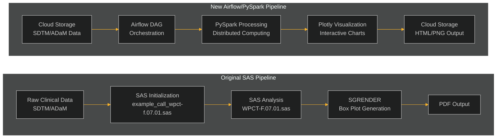

# SAS to Airflow/PySpark Migration Framework

This repository contains a comprehensive framework for migrating a SAS clinical data analysis pipeline to Airflow for orchestration and Databricks PySpark for data processing.

## Overview

The migration framework transforms a sequential SAS script execution process into a modern, scalable data pipeline using Apache Airflow and PySpark. The framework preserves the core statistical logic of the original SAS implementation while leveraging the distributed processing capabilities of Spark and the workflow management features of Airflow.

## Original vs. New Pipeline



## Pipeline Components

### 1. Airflow DAG Structure

The pipeline is implemented as a 4-task Airflow DAG:


- **Data Ingestion**: Loads clinical trial data (SDTM/ADaM) from source location
- **Data Preprocessing**: Filters and prepares data for analysis
- **Statistical Analysis**: Calculates summary statistics and identifies outliers
- **Visualization**: Generates interactive box plots using Plotly

### 2. PySpark Data Processing

The framework converts SAS data processing operations to PySpark:

- **WHERE Clauses**: Converted to PySpark DataFrame filters
- **PROC SUMMARY**: Implemented using PySpark's `groupBy().agg()` operations
- **Outlier Detection**: Implemented using PySpark's `when()` conditions

### 3. Visualization Modernization

SAS SGRENDER box plots are replaced with interactive Plotly visualizations:

- **Box Plots**: Show median, quartiles, and outliers
- **Reference Lines**: Display normal range limits
- **Interactive Features**: Hover information, zoom, pan, and export options
- **Cloud Storage**: Output saved as HTML (interactive) and PNG (static) files

### 4. Configuration Management

SAS macro variables are replaced with YAML configuration:

```yaml
# Example configuration
data_sources:
  dataset: "ADLBC"
  parameters: ["ALB"]
  visits: [0, 2, 4, 6]
```

## Directory Structure

```
airflow_migration/
├── dags/                  # Airflow DAG definitions
│   └── clinical_analysis_pipeline.py
├── scripts/               # PySpark processing scripts
│   ├── data_ingestion.py
│   ├── data_preprocessing.py
│   ├── statistical_analysis.py
│   └── visualization.py
├── utils/                 # Utility functions
│   └── phuse_utils.py
├── config/                # Configuration files
│   └── pipeline_config.yaml
└── docs/                  # Documentation
    └── sas_to_pyspark_mapping.md
```

## Implementation Details

### PhUSE Utility Functions

The framework includes Python implementations of the PhUSE utility macros used in the original SAS pipeline:

- `labels_from_var()`: Extract parameter codes and labels
- `count_unique_values()`: Count distinct values
- `get_reference_lines()`: Calculate reference lines
- `get_var_min_max()`: Determine axis ranges
- `value_format()`: Format statistical values
- `boxplot_block_ranges()`: Paginate visits for plots
- `axis_order()`: Calculate axis tick intervals

### Statistical Logic Preservation

The core statistical logic from the original SAS implementation is preserved in the PySpark implementation:

- Same summary statistics (mean, std, median, quartiles, min, max)
- Identical outlier detection logic
- Equivalent reference line calculation
- Consistent box plot visualization

## Deployment

### Databricks Setup

1. Upload the scripts and configuration to Databricks workspace
2. Configure Databricks cluster with required libraries:
   - PySpark
   - Plotly
   - PyArrow

### Airflow Configuration

1. Deploy the DAG file to your Airflow environment
2. Set up the following Airflow Variables:
   - `scripts_dir`: Path to the scripts directory
   - `config_path`: Path to the configuration file
   - `temp_dir`: Directory for temporary files

## OpenLineage and OpenMetadata Integration

The pipeline now includes comprehensive data lineage tracking and metadata management using OpenLineage and OpenMetadata, providing the data governance capabilities required for pharmaceutical regulatory compliance.

### OpenLineage Integration

OpenLineage automatically captures data lineage information from the Airflow DAG execution:

- **Data Sources**: Tracks input datasets (SDTM/ADaM)
- **Transformations**: Records data processing steps and transformations
- **Outputs**: Captures generated reports and analysis results
- **Dependencies**: Maps relationships between datasets and pipeline tasks

### OpenMetadata Integration

OpenMetadata serves as the central metadata catalog and lineage backend:

- **Schema Management**: Maintains CDISC-compliant schema definitions
- **Data Discovery**: Provides searchable catalog of clinical datasets
- **Lineage Visualization**: Interactive lineage graphs showing data flow
- **Governance**: Tracks data quality, ownership, and compliance status

### Setup Instructions

1. **Install Dependencies**:
   ```bash
   pip install -r requirements.txt
   ```

2. **Configure Environment Variables**:
   ```bash
   cp .env.template .env
   # Edit .env with your OpenLineage and OpenMetadata endpoints and tokens
   source .env
   ```

3. **Set up OpenMetadata**:
   ```bash
   python scripts/setup_openmetadata.py
   ```

4. **Configure Airflow**:
   Add the following to your `airflow.cfg`:
   ```ini
   [lineage]
   backend = airflow_provider_openmetadata.lineage.backend.OpenMetadataLineageBackend
   airflow_service_name = clinical_data_pipeline
   openmetadata_api_endpoint = http://localhost:8585/api
   jwt_token = <your-token>
   ```

### Pharmaceutical Compliance Features

- **Audit Trails**: Complete lineage tracking for regulatory submissions
- **Data Governance**: Automated compliance checking against FDA/EMA standards
- **Schema Validation**: CDISC SDTM/ADaM schema compliance verification
- **Retention Policies**: Automated data lifecycle management

### Extending to Other SAS Workflows

To migrate additional SAS workflows with lineage tracking:

1. **Identify Data Dependencies**: Map SAS dataset inputs and outputs
2. **Add Lineage Annotations**: Include `inlets` and `outlets` in Airflow tasks
3. **Update Schema Definitions**: Add new dataset schemas to `pharmaceutical_schemas.py`
4. **Configure Metadata**: Update OpenMetadata with new data sources

Example for a new SAS workflow:
```python
new_analysis_task = BashOperator(
    task_id='efficacy_analysis',
    bash_command='python scripts/efficacy_analysis.py --config config.yaml',
    inlets={"tables": ["clinical_data.adam.adeff"]},
    outlets={"tables": ["clinical_data.analysis.efficacy_results"]},
    dag=dag,
)
```

## Conclusion

This framework provides a robust foundation for migrating SAS clinical data analysis pipelines to modern, scalable data processing platforms. The combination of Airflow for orchestration, PySpark for distributed processing, OpenLineage for data lineage tracking, and OpenMetadata for metadata management offers significant advantages in terms of scalability, flexibility, maintainability, and regulatory compliance while preserving the core statistical logic of the original SAS implementation.
